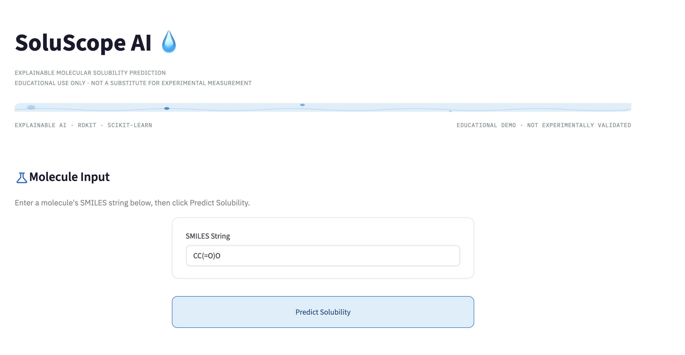
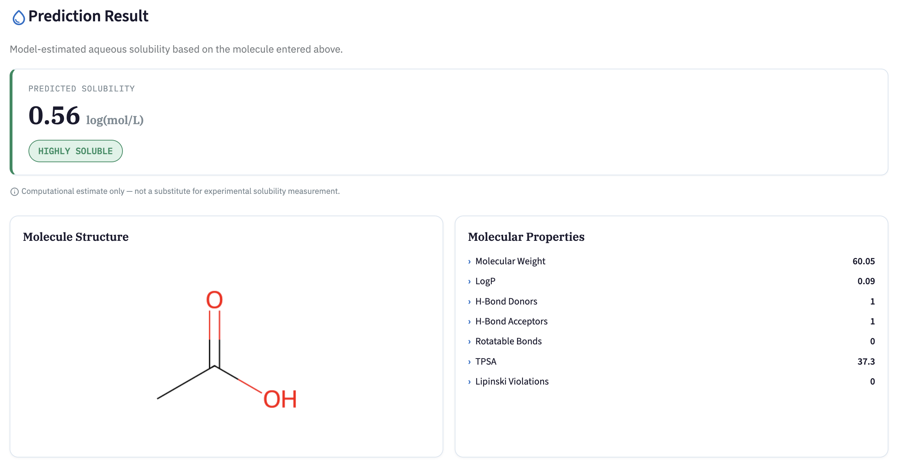
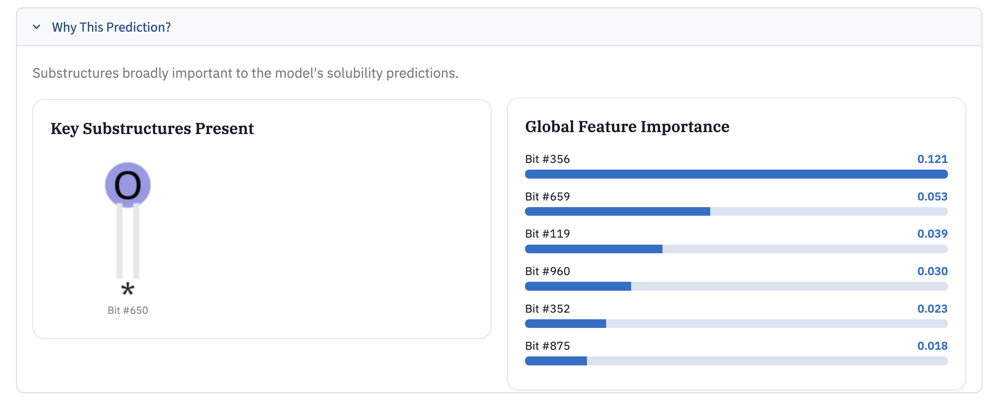

# SoluScope AI 💧


**SoluScope AI** is an explainable machine learning tool that predicts the aqueous solubility of small molecules from their chemical structure — a property that drug discovery teams rely on early in the pipeline to flag compounds that are unlikely to become viable oral drugs.

> **Disclaimer:** SoluScope AI is an educational demo built on a public benchmark dataset. Predictions are computational estimates only and have not been experimentally validated. This tool is not intended for clinical, regulatory, or commercial drug development use.

## Screenshots

**Molecule Input**


**Prediction Result**


**Why This Prediction**


## Highlights

- Predicts aqueous solubility (log S) for any valid SMILES string in real time
- Built on the MoleculeNet ESOL (Delaney) benchmark dataset
- Tuned Support Vector Regression model achieving a test R² of 0.730
- Explains predictions with global feature importance and highlighted molecular substructures, rather than treating the model as a black box
- Full SMILES validation with graceful error handling for malformed or unusually large molecules
- Containerized with Docker for reproducible deployment

## Why This Project

Aqueous solubility is one of the first properties chemists check when evaluating a candidate drug molecule — poor solubility is a leading cause of failure in preclinical development. I built SoluScope AI to explore how cheminformatics (RDKit) and machine learning (DeepChem, scikit-learn) combine to make this kind of ADMET (absorption, distribution, metabolism, excretion, toxicity) prediction fast and interpretable, and to practice building an end-to-end ML product rather than just a notebook.

## Features

- **SMILES-based prediction:** Enter any molecule as a SMILES string and get an instant solubility prediction
- **Solubility tiering:** Predictions are bucketed into Highly / Moderately / Poorly Soluble for quick interpretation
- **Molecular property display:** Molecular weight, LogP, rotatable bonds, TPSA, H-bond donors/acceptors, and Lipinski Rule of Five violations
- **Structure visualization:** 2D rendering of the input molecule via RDKit
- **Explainability:** Random Forest global feature importance plus RDKit substructure highlighting, showing which molecular fragments most influenced the prediction
- **Input validation:** Rejects invalid SMILES and warns on unusually large molecules outside the training distribution

## Tech Stack

- **Modeling:** DeepChem, scikit-learn
- **Cheminformatics:** RDKit (ECFP/Morgan fingerprints, descriptors, structure rendering)
- **App/UI:** Streamlit
- **Deployment:** Docker, Streamlit Community Cloud
- **Core:** Python, NumPy, Pandas

## Dataset

SoluScope AI is trained on the **ESOL (Delaney) dataset**, distributed through MoleculeNet, containing 1,128 compounds with experimentally measured aqueous solubility (log S). Molecules are featurized as 1024-bit ECFP (Extended-Connectivity) fingerprints with radius 2 before being passed to the model.

## How It Works

1. User submits a SMILES string
2. RDKit parses and validates the molecule
3. The molecule is featurized into a 1024-bit Morgan/ECFP fingerprint
4. A tuned Support Vector Regressor predicts normalized log solubility
5. The prediction is untransformed back to real log S units
6. The result is bucketed into a solubility tier and displayed alongside molecular properties
7. A Random Forest model (trained on the same features) supplies global feature importances, and RDKit highlights the corresponding substructures directly on the molecule

**Model comparison (validation R²):**

| Model | Validation R² |
|---|---|
| Ridge Regression | 0.545 |
| Neural Net (MultitaskRegressor) | 0.644 |
| Random Forest | 0.683 |
| Support Vector Regression | 0.741 |

The SVR architecture was carried forward and hyperparameter-tuned (`kernel=rbf, C=100, gamma=scale`), reaching a final **test R² of 0.730**.

## Getting Started

### Run locally

```bash
git clone https://github.com/smulamalla/soluscope-ai.git
cd soluscope-ai
python -m venv venv
source venv/bin/activate
pip install -r requirements.txt
streamlit run app.py
```

### Run with Docker

```bash
docker build -t soluscope-ai .
docker run -p 8501:8501 soluscope-ai
```

Then open `http://localhost:8501` in your browser.

## Project Structure

```text
soluscope-ai/
├── app.py                  # Streamlit dashboard
├── notebooks/              # Development notebooks (01–12)
├── models/                 # Trained model artifacts
│   ├── best_solubility_model.pkl
│   ├── transformer.pkl
│   ├── random_forest.pkl
│   └── top_bits.pkl
├── assets/                 # Screenshots and images used in this README
├── Dockerfile
├── .dockerignore
├── requirements.txt        # Production dependencies
└── requirements-dev.txt    # Full development dependencies
```

## Limitations

- Trained on a relatively small benchmark dataset (1,128 compounds); predictions for molecules very different from ESOL's chemical space should be treated with caution
- Solubility tiers use fixed log S cutoffs, a simplification of a continuous property
- Not validated against experimental wet-lab data beyond the ESOL test set
- Educational/portfolio project — not intended for real drug discovery decision-making

## Acknowledgments

- [DeepChem](https://deepchem.io/) for the modeling framework and MoleculeNet dataset loaders
- [RDKit](https://www.rdkit.org/) for cheminformatics and molecule rendering
- Delaney et al. for the original ESOL solubility dataset
- [Streamlit](https://streamlit.io/) for the app framework

## License

This project is licensed under the MIT License.

## Author

**Sohan Mulamalla**
AI / Machine Learning Engineer focused on healthcare applications.

GitHub: [github.com/smulamalla](https://github.com/smulamalla)
LinkedIn: [linkedin.com/in/smulamalla/](https://www.linkedin.com/in/smulamalla/)
Portfolio: [smulamalla.github.io](https://smulamalla.github.io/)